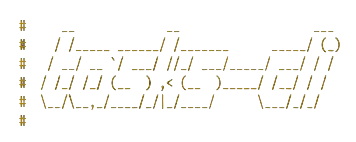

# todo-cli
[](https://github.com/Agustin-Mediotti/todo-app/actions)
[](https://github.com/Agustin-Mediotti/todo-app/blob/master/LICENSE)



A simple and interactive TODO app for the command-line, built in Rust. A Terminal User Interface (TUI) using the [Ratatui library](https://ratatui.rs/) with [Crossterm API](https://docs.rs/crossterm/latest/crossterm/).
> This project is intended for educational purposes only.

## Features

- Create, read, update, and delete tasks.
- Persistent storage in Json or raw binary.
- Interactive UI using Ratatui and Crossterm.

## Roadmap

- Config file.
- Themes.
- Inline interface.

## Installation

1. Ensure you have [Rust](https://www.rust-lang.org/tools/install) installed on your system.
2. Clone this repository
3. Navigate to the project directory and install the application with Cargo:

```bash
cd todo-app
cargo install --path .
```

4. Run the application:

```bash
todo-app
```

## License

This project is licensed under the [MIT License](LICENSE).

